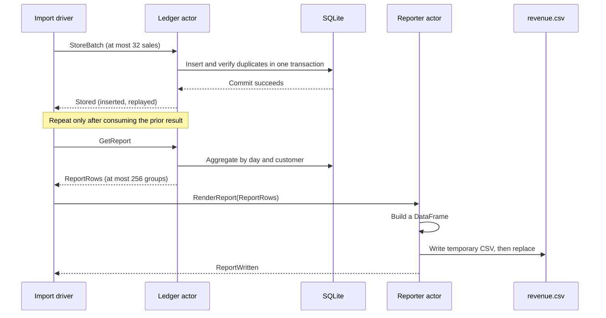

# Getting started: a sales importer with SQLite and pandas

A shop receives a CSV of orders every evening. Sometimes the same export gets
sent twice. The team needs a persistent ledger and a daily revenue report that
can be rebuilt after a failed file write, without counting those orders twice.

This tutorial uses actorplane to give each resource a clear owner:

| Part | Owns | Receives and returns |
|---|---|---|
| Import driver | CSV reader and import progress | Sends one batch, consumes its acknowledgement, then sends the next. |
| Ledger actor | One SQLite connection | Stores a transaction or returns bounded daily/customer totals. |
| Reporter actor | A pandas DataFrame and report-file writes | Receives totals and acknowledges a completed CSV replacement. |

The complete program is [examples/sales_report.py](../../examples/sales_report.py).
Its [sample sales file](../../examples/data/sales.csv) includes a duplicate order
on purpose. You need Python 3.11. SQLite is included with Python; pandas is an
optional tutorial dependency, not an actorplane runtime dependency.

## 1. Run the example

Clone the public repository to get the example and its data:

```sh
git clone https://github.com/krflol/actorplane.git
cd actorplane
```

With [uv](https://docs.astral.sh/uv/getting-started/installation/), run against the
published actorplane package in an isolated environment:

```sh
uv run --isolated --no-project --python 3.11 --with actorplane==0.1.0 --with pandas==3.0.6 python examples/sales_report.py
```

The 0.1.0 PyPI wheel supports Windows x64 and CPython 3.11. On Linux or macOS,
installation builds the published source archive and requires Rust 1.97.0 or
newer and a native compiler/linker. The repository's hosted tests also validate
Linux x64 and macOS ARM64 with CPython 3.11.

For an existing source checkout and development environment, use:

```sh
uv sync --frozen --no-install-project --group tutorial
uv run --no-sync maturin develop --locked --features extension-module,test-support
uv run --no-sync python examples/sales_report.py
```

The program creates `target/sales-demo/orders.sqlite3` and
`target/sales-demo/revenue.csv`. The database persists across runs. The report
is replaced each time; it is derived from the complete database, rather than
from only the newest input file.

## 2. Inspect the result, then replay the input

The sample contains six input rows, five distinct order IDs and one duplicate.
The first import inserts five orders totalling **24,199 cents ($241.99)**.
The report has these four groups:

| day | customer | orders | total_cents | total |
|---|---|---:|---:|---:|
| 2026-09-20 | Acme | 2 | 15000 | $150.00 |
| 2026-09-20 | Birch | 1 | 4999 | $49.99 |
| 2026-09-21 | Acme | 1 | 3000 | $30.00 |
| 2026-09-21 | Birch | 1 | 1200 | $12.00 |

Run the same command again. It should insert **zero** new orders and identify
all six input rows as replays. The database still contains five orders and the
report has the same totals. An order ID reused with different contents is an
error: the program rolls back that batch instead of silently changing a sale.

To try another file and keep its output separate:

```sh
uv run --isolated --no-project --python 3.11 --with actorplane==0.1.0 --with pandas==3.0.6 python examples/sales_report.py --input examples/data/sales.csv --db target/another-demo/orders.sqlite3 --report target/another-demo/revenue.csv
```

Use the same four CSV headers: `order_id,day,customer,amount_cents`. Dates use
`YYYY-MM-DD`; amounts are nonnegative integer cents. Integer storage avoids
rounding money through binary floating-point arithmetic.

## 3. Understand the request flow



`@event` declares serializable values and `@handles` selects the receiving
method. The batches and totals cross the native message boundary. The SQLite
connection and DataFrame remain local Python objects inside their owning actors.

For example, this is the batch schema from the program:

```python
@event("sales.Sale")
class Sale:
    order_id: Annotated[str, Length(64)]
    day: Annotated[str, Length(10)]
    customer: Annotated[str, Length(64)]
    amount_cents: Annotated[int, IntRange(0, 100_000_000)]


@event("sales.StoreBatch")
class StoreBatch:
    sales: Annotated[tuple[Sale, ...], Length(32)]
```

Import `Annotated` from `typing` and the decorators and bounds from `actorplane`.
The `Length` annotations constrain encoded string bytes and tuple items. The
CSV parser also checks business rules, such as nonempty IDs and valid dates,
before constructing a batch. These are different jobs: a string can satisfy
its byte limit without being a valid date.

`world.spawn()` registers an actor class. The first driver step constructs the
instance and calls its startup hook. The example's actor factories capture
configuration paths; each new actor still creates its own live resources.

The outer driver submits requests and pumps the World until an operation has a
terminal result. It then consumes that result before submitting another request.
Handlers do not wait on other handlers or recursively drive the World.

The request helper uses this pattern:

```python
operation = world.request(owner, target, event, timeout=5.0)
while operation.poll() is None:
    world.run_for(0.005)
reply = operation.result()
```

`poll()` observes completion. `result()` consumes the retained result and raises
for cancellation or expiry. The helper runs in the outer driver, never inside
an actor handler.

## 4. Give the database connection one owner

The ledger opens its connection in `on_start` and closes it in `on_stop`. It
retains SQLite's normal thread check: creation, queries and cleanup all happen
on the same foreground driver thread. Other actors request database work by
message rather than borrowing the connection.

These are the resource-owning parts of the ledger (the full example also
creates the table in `on_start`):

```python
class _Ledger(Actor):
    def __init__(self, db_path: Path):
        self.db_path = db_path
        self.db = None

    def on_start(self, ctx):
        self.db = sqlite3.connect(self.db_path, timeout=1.0)

    def on_stop(self, ctx):
        if self.db is not None:
            self.db.close()
            self.db = None
```

The program registers this actor through `_ledger_actor(db_path)`, a factory
that returns a class with a zero-argument constructor. This matches
`world.spawn()`'s class-based API while keeping the connection out of its
configuration:

```python
def _ledger_actor(db_path: Path):
    class Ledger(_Ledger):
        def __init__(self):
            super().__init__(db_path)
    return Ledger

# Inside the outer `with World(...) as world:` block:
owner = world.spawn(Actor)
ledger = world.spawn(_ledger_actor(db_path), parent=owner)
reporter = world.spawn(_reporter_actor(report_path), parent=owner)
world.step()  # Construct actors and run their startup hooks.
```

Each `StoreBatch` is a database transaction. `order_id` is a primary key; an
existing ID is accepted only when its stored fields match the incoming fields.
If a conflict appears halfway through a batch, the earlier inserts in that
same transaction roll back too. Previously committed batches remain committed.

The transaction starts with `BEGIN IMMEDIATE`, so duplicate checks and inserts
share one write transaction. SQLite's connection context commits or rolls back;
it does not close the connection. `on_stop` performs that separate cleanup.

The handler acknowledges **after commit**. Mailbox admission alone does not
mean the data reached the database. Likewise, a request timeout does not prove
that a database write was rolled back: the write might finish after the reply
deadline. Replaying the original IDs lets SQLite resolve that uncertainty.

The code uses bound SQL parameters and a one-second SQLite lock wait.
[Python's SQLite documentation](https://docs.python.org/3.11/library/sqlite3.html)
describes its transaction and connection-thread behavior.

## 5. Build a DataFrame and write a complete report

The ledger aggregates in SQL and returns small, typed totals. The reporter
creates its DataFrame with `pandas.DataFrame.from_records`, then formats the
display amount from integer cents. It writes with `DataFrame.to_csv(index=False)`.
The DataFrame construction in the program is:

```python
frame = pd.DataFrame.from_records(
    records, columns=["day", "customer", "orders", "total_cents", "total"]
)
```

`records` is a bounded list of plain dictionaries derived from `SalesTotal`
messages. It includes integer totals for later calculations and a formatted
dollar string for reading the report. An empty ledger still produces the CSV
header.

See the pandas references for
[from_records](https://pandas.pydata.org/docs/reference/api/pandas.DataFrame.from_records.html)
and [to_csv](https://pandas.pydata.org/docs/reference/api/pandas.DataFrame.to_csv.html).

The destination is updated only after a temporary file in the same directory
has been written and closed. `os.replace` then replaces the old report. If
writing or replacing fails, the temporary file is removed and the prior report
is retained. The program rejects a report path that aliases its input or database.

The file-writing section closes the temporary file before replacement, which
also matters on Windows:

```python
temporary = tempfile.NamedTemporaryFile(
    mode="w", encoding="utf-8", newline="", suffix=".tmp",
    dir=self.report_path.parent, delete=False,
)
temporary_name = Path(temporary.name)
try:
    with temporary:
        frame.to_csv(temporary, index=False)
    os.replace(temporary_name, self.report_path)
finally:
    temporary_name.unlink(missing_ok=True)
```

SQLite and the CSV are **not one transaction**. If the database commit succeeds
but the report fails, fix the output path and run the importer again. Existing
orders are replayed without duplication, and the report is regenerated from
the ledger. Replacement does not provide a power-loss durability guarantee;
this example does not call `fsync` on the file and directory.

## 6. Know the limits you are choosing

The example reads at most 32 sales into an input batch and keeps one request
outstanding. The report query requests one more than its 256-group limit so it
can reject an oversized result instead of silently truncating it. The World
has four actor slots, four entries/32 KiB per mailbox, a 32 KiB event limit,
128 KiB of native payload storage and two operation slots. The input file is
limited to 8 MiB. Amounts range from zero to 100,000,000 cents per order.

These limits bound application messages and the DataFrame's input, not the
database's disk usage or SQL query cost. For a growing ledger, request a date
range, paginate results or generate partitioned reports instead of simply
increasing every limit.

SQLite calls, pandas operations and file writes in this example are synchronous
Python callbacks. They block other Python callbacks in this World while they
run. actorplane's native CPU pool is not a generic Python thread pool. This
example teaches resource ownership, transaction acknowledgements, replay and
bounded work; it does not claim parallel database or pandas execution.

The final explicit drain checks native/Python shutdown completion, and the
context manager also closes actors on errors. The example explicitly selects
`FailurePolicy.STOP_WORLD`, so an unhandled handler exception aborts the
workflow. This tutorial does not provide automatic restart or retry.

## 7. Try a failure and extend the workflow

Copy the sample input, change the amount for `o1001`, and import it into the
existing database. The import should fail and the old report should remain.
Restore the original amount and replay successfully.

Next, point `--report` at an existing directory to make replacement fail. The
orders can still be committed. Repeating the import with a writable CSV path
rebuilds the report without adding duplicate orders.

The [integration tests](../../tests/test_sales_tutorial.py) exercise those
failures, replays, the report-size limit and output-path collisions. Run them
from the source environment with:

```sh
uv run --no-sync pytest -q tests/test_sales_tutorial.py
```

Useful extensions include a date-range report request, a second report format,
or several producers sharing the same ledger actor. Each producer should retain
stable order IDs and a bounded number of outstanding requests. To adapt this
to PostgreSQL, keep connection ownership explicit and use that database's
transaction and connection-pool semantics; actorplane does not supply a
PostgreSQL pool in this release.
